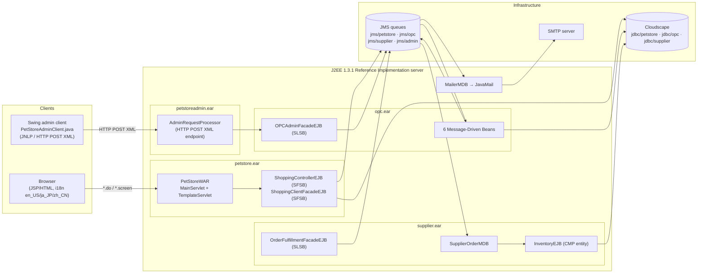
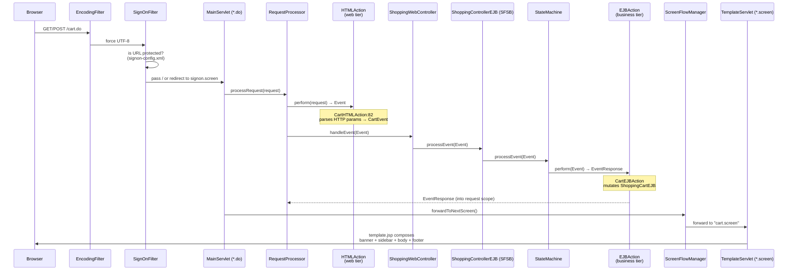
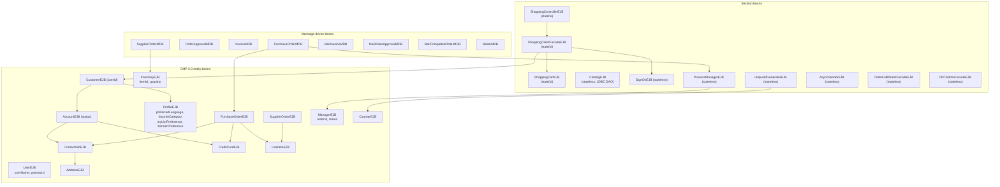
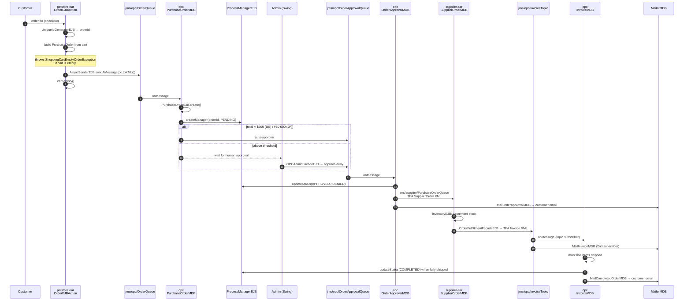
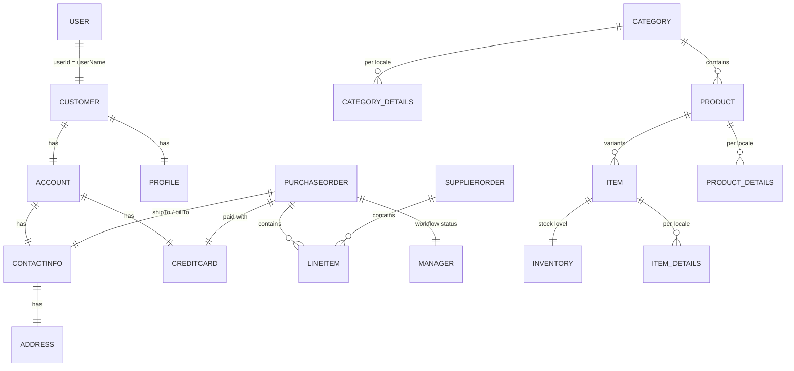

# Java Pet Store 1.3.1_02 — Legacy Architecture

> Reverse-engineered from source at `petstore1.3.1_02/src`.
> Every claim below is anchored to a file path so it can be verified during walkthrough.

## 1. What this application is

Sun's **J2EE BluePrints Java Pet Store Demo, version 1.3.1_02** (build date Jan 2003). It is not
one application — it is **four separately deployed EAR files** that communicate through JMS
queues, plus a shared library of 16 reusable "components".

| EAR | Source root | Role |
| --- | --- | --- |
| `petstore.ear` | `src/apps/petstore` | Customer-facing storefront (JSP + servlet + session EJBs) |
| `opc.ear` | `src/apps/opc` | Order Processing Center — async order workflow (MDBs) |
| `supplier.ear` | `src/apps/supplier` | Supplier / warehouse — inventory + shipping |
| `petstoreadmin.ear` | `src/apps/admin` | Admin console — order approval (Swing/JNLP client + web tier) |

Scale: **309 `.java` files, 98 JSPs, 95 XML descriptors**, 33 EJBs.

### Runtime target (the reason it does not run today)

`petstore1.3.1_02/docs/installing.html` requires:

- **J2SE SDK 1.4.1**
- **J2EE SDK 1.3.1** (Sun's Reference Implementation app server) — provides the EJB container,
  JMS provider, and JavaMail
- **Cloudscape** (the RI's bundled DB, ancestor of Apache Derby)

All deployment descriptors are RI-proprietary (`sun-j2ee-ri.xml` in every module). Bootstrap is
Ant 1.x driven by `setup.xml` (`create_jms_queues`, `create_petstore_db`, `create_supplier_db`,
`create_opc_db`, `deploy`).

---

## 2. Container / deployment view

**Key point for migration risk:** the four EARs are only ever coupled through **JMS text messages
carrying XML documents** (`src/components/xmldocuments`) and through a shared relational schema.
That seam is what makes an incremental, strangler-style migration possible.

---

## 3. Web tier — the WAF (Web Application Framework)

The storefront does not use Struts; it uses BluePrints' own MVC micro-framework, `src/waf`.
This is the single most important thing to understand about the codebase, because **almost all
"where does the logic live?" questions resolve here**.

### The three configuration files that *are* the routing table

| File | What it decides |
| --- | --- |
| `apps/petstore/src/docroot/WEB-INF/mappings.xml` | URL → `HTMLAction` → next screen; Event class → `EJBAction`; exception class → error screen |
| `apps/petstore/src/docroot/WEB-INF/screendefinitions_en_US.xml` | Screen name → JSP fragments (19 screens; `_ja_JP` and `_zh_CN` variants exist) |
| `apps/petstore/src/docroot/WEB-INF/signon-config.xml` | Which URLs require authentication |

### The 7 request URLs

| URL | Web action | Event | EJB action | Next screen |
| --- | --- | --- | --- | --- |
| `cart.do` | `CartHTMLAction` | `CartEvent` | `CartEJBAction` | `cart.screen` |
| `order.do` | `OrderHTMLAction` | `OrderEvent` | `OrderEJBAction` | `order_complete.screen` |
| `customer.do` | `CustomerHTMLAction` | `CustomerEvent` | `CustomerEJBAction` | `customer.screen` |
| `createuser.do` | `CreateUserHTMLAction` | `CreateUserEvent` | `CreateUserEJBAction` | `create_customer.screen` |
| `createcustomer.do` | `CustomerHTMLAction` | `CustomerEvent` | `CustomerEJBAction` | via `CreateUserFlowHandler` |
| `signoff.do` | `SignOffHTMLAction` | `ChangeLocaleEvent` (!) | `ChangeLocaleEJBAction` | `signoff.screen` |
| `changelocale.do` | `ChangeLocaleHTMLAction` (WAF) | `ChangeLocaleEvent` | `ChangeLocaleEJBAction` | via `ClientStateFlowHandler` |

Catalog browsing (`category`, `product`, `item`, search) is **not** in this table — those screens
are rendered straight from JSPs that call `CatalogHelper`
(`components/catalog/src/.../client/CatalogHelper.java`), bypassing the controller entirely.

### Navigation cheat-sheet

| Question | Answer |
| --- | --- |
| Front controller | `waf/src/.../controller/web/MainServlet.java:108` |
| Web-tier dispatch | `waf/src/.../controller/web/RequestProcessor.java:117` |
| Business-tier dispatch | `waf/src/.../controller/ejb/StateMachine.java:92` |
| Screen forwarding + error screens | `waf/src/.../controller/web/flow/ScreenFlowManager.java:164` |
| Templating engine | `waf/src/view/template/.../TemplateServlet.java` + `docroot/template.jsp` |
| Authentication filter | `components/signon/src/.../web/SignOnFilter.java` |
| Catalog SQL | `apps/petstore/src/docroot/CatalogDAOSQL.xml` |
| Seed data + catalog DDL | `apps/petstore/src/docroot/populate/PopulateSQL.xml`, `Populate-UTF8.xml` |
| JNDI name constants | `*/util/JNDINames.java` (one per module) |

---

## 4. Business tier — EJB inventory (33 beans)

**Note the duplication:** `AddressEJB`, `ContactInfoEJB`, `CreditCardEJB` and `LineItemEJB` are
each declared in *multiple* `ejb-jar.xml` files (customer, contactinfo, purchaseorder,
supplierpo) because EJB 2.0 CMP relationships cannot cross jar boundaries. In a modern rewrite
these collapse into single embeddable value objects — a concrete simplification win.

### Persistence is split two ways

- **Catalog** (read-heavy, denormalised, i18n) uses a hand-written **DAO with externalised SQL**:
  `CatalogDAOSQL.xml` holds 7 named statements per database dialect (`cloudscape`, `oracle`),
  selected at runtime by `CatalogDAOFactory`. Tables: `category`, `category_details`, `product`,
  `product_details`, `item`, `item_details` — the `_details` tables carry the `locale` column.
- **Everything else** uses **CMP 2.0 container-managed persistence** — the schema is generated by
  the container, not checked in. This is a migration hazard: *there is no authoritative DDL in
  the repo for the customer/order tables.*

---

## 5. Order fulfilment — the asynchronous workflow

This is the part of the system with real business logic and the part most at risk in a migration.

### Messaging topology (logical name → physical JNDI)

Resolved from each module's `sun-j2ee-ri.xml`. Note that **invoices travel over a Topic, not a
Queue** — `InvoiceMDB` and `MailInvoiceMDB` are two independent subscribers, so the
publish/subscribe fan-out is load-bearing and must survive the migration.

| Producer | Logical ref | Physical destination | Consumer |
| --- | --- | --- | --- |
| petstore `AsyncSenderEJB` | `jms/AsyncSenderQueue` | `jms/opc/OrderQueue` (queue) | opc `PurchaseOrderMDB` |
| opc `PurchaseOrderTD` / `OPCAdminFacadeEJB` | `jms/OrderApprovalQueue` | `jms/opc/OrderApprovalQueue` (queue) | opc `OrderApprovalMDB` |
| opc `OrderApprovalTD` | `jms/PurchaseOrderQueue` | `jms/supplier/PurchaseOrderQueue` (queue) | supplier `SupplierOrderMDB` |
| opc `OrderApprovalTD` | `jms/OrderApprovalMailQueue` | `jms/opc/MailOrderApprovalQueue` (queue) | opc `MailOrderApprovalMDB` |
| supplier `OrderFulfillmentFacadeEJB` | `jms/InvoiceTopic` | `jms/opc/InvoiceTopic` (**topic**) | opc `InvoiceMDB` **and** `MailInvoiceMDB` |
| opc `InvoiceTD` | `jms/CompletedOrderMailQueue` | `jms/opc/MailCompletedOrderQueue` (queue) | opc `MailCompletedOrderMDB` |
| opc `Mail*MDB` | `jms/MailQueue` | `jms/opc/MailQueue` (queue) | `MailerMDB` → JavaMail |

### Business rules worth pinning down (these are the parity tests)

| Rule | Location |
| --- | --- |
| Auto-approve under $500 US / ¥50 000 JP | `apps/opc/src/.../opc/ejb/PurchaseOrderMDB.java:183` (`canIApprove`) |
| Order lifecycle `PENDING → APPROVED\|DENIED → COMPLETED` | `components/processmanager/src/.../ejb/OrderStatusNames.java` |
| Empty cart cannot be ordered | `OrderEJBAction` → `ShoppingCartEmptyOrderException` → `cart_empty_order_error.screen` |
| Duplicate account rejected | `DuplicateAccountException` → `duplicate_account.screen` |
| Order IDs = counter name `"1001"` used as a string **prefix** + incrementing DB counter (`10011`, `10012`, …) | `components/uidgen/src/.../counter/ejb/CounterEJB.java:67`, called from `OrderEJBAction` as `getUniqueId("1001")` |
| Partial shipment: order completes only when *all* line items shipped | `InvoiceMDB.doWork` |
| Mail sending is **disabled by default** | `apps/opc/src/ejb-jar.xml` — `param/SendConfirmationMail`, `param/SendApprovalMail`, `param/SendCompletedOrderMail` all `false` |
| Inter-app messages are XML validated against DTDs | `param/xml/validation/*` env-entries = `true` |

---

## 6. Domain / data model

The catalog side is **document-shaped**: a category has localised names/descriptions, products
hang off categories, items hang off products with five free-form attributes (`attr1`..`attr5`).
The order side is an **aggregate**: a purchase order owns its line items, addresses and card
details outright and is never shared. Both shapes map far more naturally to documents than to the
six-way join in `CatalogDAOSQL.xml` — relevant to the MongoDB stretch goal.

---

## 7. Findings that will drive migration decisions

| # | Finding | Evidence | Implication |
| --- | --- | --- | --- |
| 1 | **Passwords stored and compared in plaintext** | `components/signon/src/.../user/ejb/UserEJB.java:88` — `password.equals(getPassword())` | Must not be carried forward. Replace with a modern hash; this is a deliberate deviation from strict parity. |
| 2 | No authoritative DDL for non-catalog tables | CMP 2.0 auto-schema | Data model must be re-derived from `ejb-jar.xml` CMP fields (done in §4). |
| 3 | Sign-on is a **custom filter**, not container security | `signon-config.xml` + `SignOnFilter` | Maps cleanly onto Spring Security filter chain. |
| 4 | Value objects duplicated across 4 EJB jars | `AddressEJB` etc. declared 4× | Collapse into shared embeddables. |
| 5 | Presentation is server-rendered JSP with a bespoke template engine | `TemplateServlet` + 19 screen definitions | Choose deliberately: keep server-side rendering, or expose REST + SPA. Affects "functional equivalence" claims. |
| 6 | i18n is first-class (en_US, ja_JP, zh_CN) with locale-scoped catalog rows | `screendefinitions_*.xml`, `*_details.locale` | Easy to silently drop; must be an explicit scope decision. |
| 7 | Four apps coupled only via XML-over-JMS | `components/xmldocuments` | Enables strangler migration app-by-app rather than big bang. |
| 8 | Admin client is a **Swing desktop app** talking XML over HTTP POST | `apps/admin/src/client/PetStoreAdminClient.java` | Almost certainly out of scope; needs an explicit call. |
| 9 | Email is disabled by default | env-entries in `apps/opc/src/ejb-jar.xml` | Parity baseline does not include SMTP. |
| 10 | `webservices/` contains a JAX-RPC variant of opc↔supplier | `src/webservices` | Duplicate of the JMS path; exclude from scope. |
| 11 | **`mappings.xml` declares `SignOffEvent` → `SignOffEJBAction`, neither of which exists in the source tree** | `apps/petstore/src/docroot/WEB-INF/mappings.xml`; `grep -r SignOffEvent src` returns nothing | Dead configuration. `SignOffHTMLAction:69` actually invalidates the session, rebuilds the `PetstoreComponentManager`, and returns a **`ChangeLocaleEvent`** — so `SignOffEvent` is never raised and the mapping is unreachable. Do not port it; it is also a good argument for validating config-driven dispatch tables at startup in the new app. |

---

## 8. Open scope questions

1. **Which app(s) are in scope?** The brief says "for kitchensink only", but this repository
   contains Pet Store, not the JBoss `kitchensink` quickstart. Migrating all four EARs is a very
   different exercise from migrating the storefront.
2. **UI strategy** — keep server-rendered pages (closest to parity, easiest to demo side-by-side)
   or move to REST + SPA?
3. **Async workflow** — keep real messaging (embedded broker) or collapse to in-process events?
   Keeping it is much closer to functional equivalence.
4. **Admin Swing client** — replace with a web admin screen, or drop?
