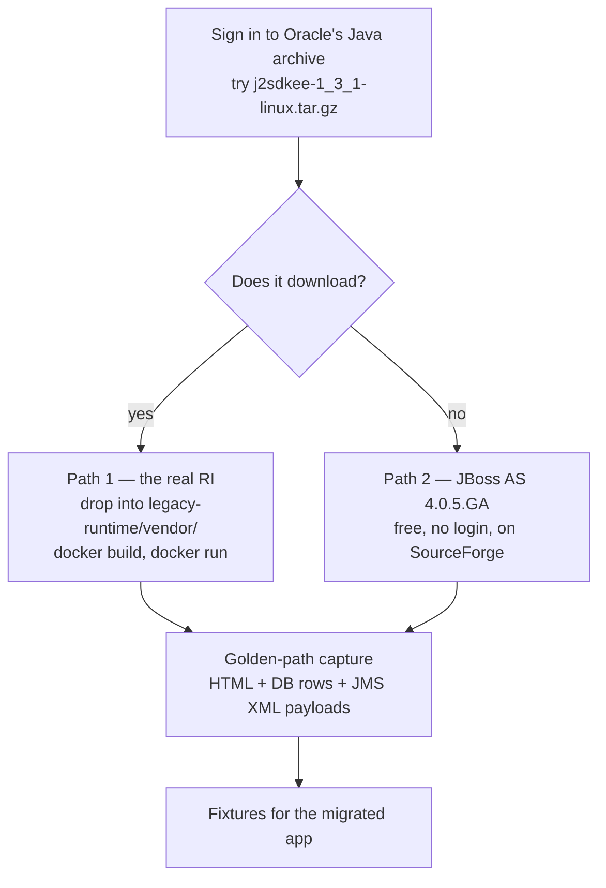

# Running the legacy Pet Store — assessment and plan

> **Scope status: out of scope for the build, per [ADR-0002](adr/0002-migration-scope.md).**
> This document is kept because the analysis is load-bearing for the panel — it is the evidence
> behind that decision, and the "how would you approach an unknown environment" answer. §5 gives
> a near-zero-cost hedge in case the panel does ask to see the legacy app.

## 0. Do we actually have to run it? The two sources disagree

| Source | What it says |
| --- | --- |
| **The challenge PDF** (`docs/ModFac Developer Candidate Challenge.pdf`) | "Deliver a live demo of the running **migrated** application." Nothing about running the legacy one. |
| **The candidate-portal prep notes** (guide.co) | "The app must run: Ensure **both** the legacy and modernized versions are functional. You should be able to run the application live during the presentation **if requested**." Also: "be prepared to demonstrate how the legacy app works." |

The portal notes are later guidance layered on the PDF, so they are not safely ignored — but the
live-run clause is conditional ("if requested"), and "demonstrate how the legacy app works" is
satisfied by [`01-legacy-architecture.md`](01-legacy-architecture.md), which is derived from
source and anchored to file and line.

**Decision (ADR-0002):** do not spend budget standing up a qemu/JDK-1.4 environment. Derive the
parity baseline from source and seed data instead. That protects roughly a day.
**Hedge (§5):** the container scaffold is already written and costs nothing further; the only
missing piece is a licensed binary that has to be fetched by hand. Fifteen minutes, not a day.

## 1. What the app demands

From `petstore1.3.1_02/docs/installing.html` and `setup.sh`:

| Requirement | Version | Status |
| --- | --- | --- |
| J2SE SDK | **1.4.1+** | EOL 2008. No macOS/arm64 build has ever existed. 32-bit x86 Linux binary still on Oracle's archive behind a login. |
| J2EE SDK (Sun RI app server) | **1.3.1** | Discontinued. Not on Maven Central, not on archive.org, not in the Wayback Machine. See §4. |
| Cloudscape DB | bundled with the RI | Became Apache Derby, but the RI's `cloudscape` scripts are not Derby drop-ins. |
| Ant | 1.x, vendored at `src/lib/ant` | Present in the repo. |
| Deployment descriptors | `sun-j2ee-ri.xml` per module | RI-proprietary. **No other container has ever read this format** — not JBoss, not Geronimo, not GlassFish (which uses `sun-ejb-jar.xml`, a different schema). |

`setup.sh` hard-fails without `J2EE_HOME`, and `setup.xml` drives RI-only Ant tasks that shell
out to `j2eeadmin` and `deploytool`.

## 2. Provenance — is this the right Pet Store?

Yes. Oracle's [Java Pet Store page](https://www.oracle.com/java/technologies/petstore-v1312.html)
offers exactly one bundle, `petstore-1_3_1_02.zip`, and the local tree matches it:

- `docs/release_notes.txt` → "Java Pet Store Demo 1.3.1_02"
- `docs/whatsnew.html` → the 1.3.1_02 changes: Chinese localisation plus bug fixes
- EAR entries timestamped `2003-01-08`, `Created-By: Ant 1.3`

The Oracle download link resolves to the anchor `#7172-petstore-1.3.1_02-demo-oth-JPR` on the
Java EE archive page. Same artefact.

## 3. Host environment — verified, not assumed

```
java -version                       OpenJDK 21.0.9 (arm64), Oracle JDK 25 also installed
mvn -v                              Apache Maven 3.9.12
docker --version                    29.7.2
docker info                         server 29.7.2, os linux, arch aarch64, 10 CPUs
docker run --platform linux/amd64   uname -m → x86_64        ← emulation works
uname -m                            arm64
df -h                               1.2 TB free
```

### Two setup problems hit along the way

1. **`docker` was not on `PATH`.** `/usr/local/bin/docker` is a symlink to
   `/Applications/OrbStack.app`, which has been uninstalled — a stale link shadowing the real
   Docker Desktop CLI at `/Applications/Docker.app/Contents/Resources/bin/docker`.
2. **`docker run` then failed** with `error getting credentials — docker-credential-osxkeychain
   not found`, for the same reason: the credential helper in `/usr/local/bin` is another dangling
   OrbStack symlink.

Both are fixed by putting Docker Desktop's own bin directory first:

```bash
export PATH=/Applications/Docker.app/Contents/Resources/bin:$PATH
```

Worth cleaning up properly (the stale root-owned symlinks in `/usr/local/bin` need `sudo` to
remove), but the `PATH` prefix is enough to work.

## 4. The one remaining blocker

**The J2EE SDK 1.3.1 runtime binary.** What was checked:

| Source | Result |
| --- | --- |
| Oracle Java EE archive downloads page | Lists Pet Store 1.3.1_02 and *documentation* for 1.3.1 — **no runtime bundle** |
| Oracle's `java2sdk-release-v131.html` | The *install instructions* survive and name `j2sdkee-1_3_1-linux.tar.gz`, but link to nothing |
| Maven Central | Not published |
| archive.org (`mediatype:software`) | 0 hits |
| Wayback Machine CDX over `java.sun.com/j2ee/*` | No capture of any `j2sdkee` binary |
| `download.oracle.com/otn/java/j2ee/1.3.1/j2sdkee-1_3_1-linux.tar.gz` | Redirects to Oracle SSO |

> **Do not read that last row as "the file exists."** A deliberately bogus filename in the same
> directory redirects to the identical login page, so the SSO gate sits *in front of* the
> existence check. From outside the login there is no way to tell a live file from a 404. The
> only way to find out is to sign in and try.

I cannot do that step — it needs an account and credentials. It has to be done by hand.

## 5. The hedge — time-boxed, RI first, JBoss as the fallback



### Path 1 — the original RI (perfect fidelity)

Scaffolding is already written and waiting in [`legacy-runtime/`](../legacy-runtime/) — this
was built before ADR-0002 landed, and is kept because it is finished and costs nothing to hold:
a `Containerfile` targeting `linux/amd64`, an `entrypoint.sh` that follows `installing.html`'s
exact boot order, and a gitignored `vendor/` for the licensed binaries. Drop the two tarballs in
and build. **Time-box the download hunt to about fifteen minutes** — if it is gone, it is gone.

### Path 2 — JBoss AS 4.0.5.GA (high fidelity, definitely obtainable)

Same application source, a period-appropriate open-source EJB 2.0 container, and downloads that
need no login. The work is writing `jboss.xml` and `jbosscmp-jdbc.xml` to replace
`sun-j2ee-ri.xml`: roughly 33 bean bindings, the JNDI names, and seven JMS destinations.

Two things checked before recommending this, so it is not a guess:

- **JBoss 4.0.5.GA is downloadable** from SourceForge without an account.
- **The source compiles on a modern JDK.** Scanned all 309 files for identifiers that later
  became keywords — `enum`, `assert`, `var`, `record`, `sealed`, `yield` — and found **zero**.
  Every EE API it imports (`javax.ejb`, `javax.jms`, `javax.servlet`, `javax.mail`,
  `javax.transaction`, `javax.naming`, `javax.rmi`, `javax.activation`, `javax.sql`,
  `javax.swing`, `javax.xml`) is still on Maven Central under its `javax` coordinates.

Rejected outright: running the Ant build on JDK 21 (no container to deploy to), redeploying the
prebuilt EARs on WildFly or Payara (EJB 2.0 CMP entity beans are gone from Jakarta EE 10, and the
descriptors are unreadable there), and Geronimo or GlassFish (same descriptor problem).

## 6. What replaces the running baseline

With the legacy app out of scope, "functional equivalence" has to be evidenced some other way, or
it is just an assertion. Three substitutes, in descending order of strength:

1. **The business rules in [`01-legacy-architecture.md`](01-legacy-architecture.md) §5**, each
   anchored to a file and line, each becoming a test in the migrated app. The $500 / ¥50,000
   `canIApprove` threshold, the `PENDING → APPROVED | DENIED → COMPLETED` lifecycle, "an order
   completes only when every line item has shipped", the empty-cart rejection, the `1001`-prefixed
   order IDs.
2. **The seed data**, which is checked in and needs no running server:
   `apps/petstore/src/docroot/populate/Populate-UTF8.xml` and `PopulateSQL.xml`. The migrated app
   loads the same catalog, so catalog output can be compared row for row.
3. **The inter-app XML contracts** in `components/xmldocuments`, with their DTDs. These are the
   most valuable fixtures in the exercise — a precise, machine-checkable description of what the
   four applications say to each other, available without running anything.

If the hedge in §5 pays off, add: golden-path HTML captures, a below/above-threshold order pair,
and the actual JMS payloads. Better evidence, but not worth a day of the budget to obtain.
