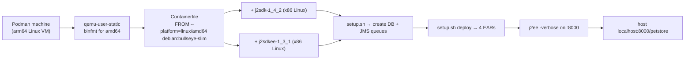

# Running the legacy Pet Store — assessment and plan

The take-home requires the **legacy app to be runnable during the panel**, not just the migrated
one. This document records what the legacy stack actually needs, what was verified on this
machine, and the options for getting it up.

## 1. What the app demands

From `petstore1.3.1_02/docs/installing.html` and `setup.sh`:

| Requirement | Version | Status today |
| --- | --- | --- |
| J2SE SDK | **1.4.1** | EOL 2008. No macOS/arm64 build has ever existed. |
| J2EE SDK (Sun RI app server) | **1.3.1** | Discontinued. Ships Solaris/Linux/Windows x86 only. Not on Maven Central. |
| Cloudscape DB | bundled with the RI | Became Apache Derby; the RI's `cloudscape` scripts are not Derby-compatible drop-ins. |
| Ant | 1.x, vendored at `src/lib/ant` | Present in the repo. |
| Deployment descriptors | `sun-j2ee-ri.xml` per module | RI-proprietary; no other container reads them. |

`setup.sh` hard-fails without `J2EE_HOME`, and `setup.xml` drives RI-only Ant tasks
(`create_jms_queues`, `create_petstore_db`, `deploy`) that shell out to the RI's `j2eeadmin`
and `deploytool`.

## 2. What this machine has

Verified:

```
java -version        → OpenJDK 21.0.9 (arm64)  +  Oracle JDK 25 installed
mvn -v               → Apache Maven 3.9.12
podman --version     → 5.7.1   (no VM initialised yet)
docker               → not installed
ant                  → not installed (vendored copy exists in the repo)
uname -m             → arm64
free disk            → 1.2 TB
```

The blocker is unambiguous: **there is no JVM on this machine that can load J2SE-1.4-era classes
under a J2EE 1.3 container, and the container binary itself no longer exists in distribution.**
This is not a configuration problem — it is a missing-artifact problem.

## 3. Options considered

| # | Option | Verdict |
| --- | --- | --- |
| A | Run the vendored Ant build against JDK 21 | **Rejected.** `javax.ejb`, `javax.jms`, EJB 2.0 CMP abstract-bean compilation and the RI's `deploytool` are all absent. Even if it compiled, nothing would deploy it. |
| B | Deploy the prebuilt `.ear` files to a modern server (WildFly / Payara) | **Rejected.** EJB 1.1/2.0 CMP entity beans were removed from Jakarta EE 10 and the descriptors are RI-specific. Would require rewriting every descriptor — i.e. doing the migration, which defeats the purpose of a baseline. |
| C | Old JBoss AS 4.x on JDK 1.4/5 | **Rejected.** JBoss never read `sun-j2ee-ri.xml`; a community port existed but is not in this repo, and JDK 1.4 for arm64 still does not exist. |
| D | **amd64 Linux container with JDK 1.4.2 + J2EE SDK 1.3.1, run under Podman with qemu emulation** | **Recommended.** Reproducible, checked into the repo as a `Containerfile`, and honest about being emulated. Slow but demonstrable. |
| E | Do not run the legacy app; substitute a recorded walkthrough plus a static replica of the screens | Fallback if D's binaries cannot be sourced. |

## 4. Option D — what it takes



Steps:

1. `podman machine init && podman machine start` (one-time, downloads an arm64 Linux VM image).
2. Confirm the machine has `binfmt_misc` + `qemu-user-static` so `--platform linux/amd64` works.
3. Source two archived Sun binaries (`j2sdk-1_4_2_*-linux-i586.bin`, `j2sdkee-1_3_1-linux.bin`).
   **These are the single point of failure** — Oracle's archive pages now require a login, so they
   must be located and their checksums recorded in the repo.
4. Build the image, run `setup.sh`, `setup.sh deploy`, expose `:8000` and `:1050` (RMI).
5. Hit `http://localhost:8000/petstore/populate` once to seed the catalog.

Expect the container to be slow — the entire JVM runs under instruction emulation.

## 5. Why running the legacy app matters beyond "the brief says so"

It is the only way to produce a **behavioural baseline**. Without it, "functional equivalence" is
an assertion. With it, the plan is:

1. Drive the legacy UI through the golden paths (browse → cart → sign-on → checkout → order
   status) and capture the rendered HTML and the resulting DB rows.
2. Capture the four inter-app XML message payloads off the JMS queues.
3. Turn those captures into fixtures the modernised app is tested against — the XML documents in
   particular are a precise, machine-checkable contract (see `components/xmldocuments`).

That fixture set is the deliverable that de-risks the migration; the running legacy app is just
the means of producing it.

## 6. Decision needed

Proceed with Option D (accepting the binary-sourcing risk and the emulation slowness), or fall
back to Option E and invest the time in the migration instead?
