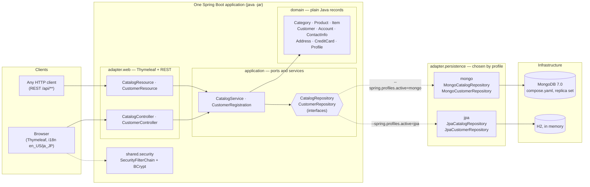
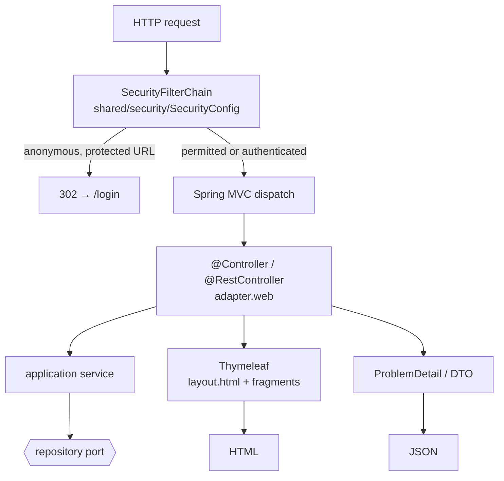
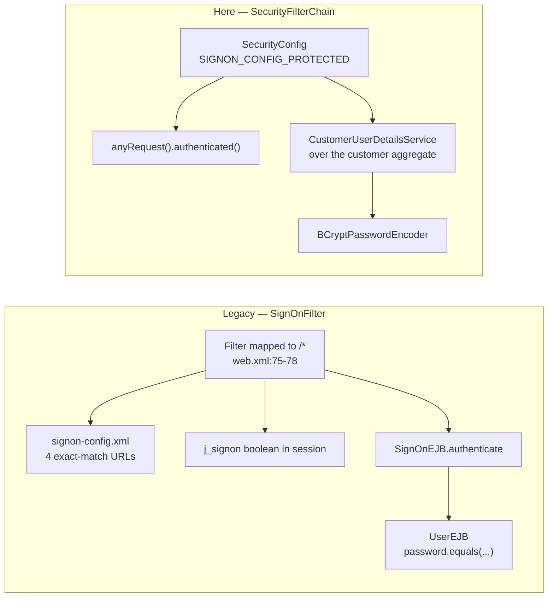

# 07 — The migrated application

**Issue:** 8.2 (#50) · **Companion to:** [`01-legacy-architecture.md`](01-legacy-architecture.md),
whose diagrams this one is meant to be read beside · **Scope:** ADR-0006

The legacy document reverse-engineers what was there. This one describes what replaced it, in the
same sections and the same diagram style, so the two can be put side by side. Every claim here has
a test or a `file:line` behind it; where something was *not* built, it says so rather than
describing an intention.

---

## 1. What this application is

One Spring Boot 4.1.1 application on Java 21. **66 Java files in `src/main`, 63 in `src/test`**,
against the legacy's 309 — a ratio that means nothing on its own, because this is a vertical slice
(ADR-0006), not the whole of Pet Store. What it does mean is that the test tree is now roughly the
size of the production tree, where the legacy had **no tests at all**.

Four EARs become one deployable with the boundaries kept as packages and enforced by ArchUnit
rather than by classloaders. 33 EJBs become 9 built components; the other 24 are designed and
deferred or dropped — see [`06-traceability-matrix.md`](06-traceability-matrix.md), which has a row
for each.

---

## 2. Container / deployment view

Compare with §2 of the legacy document: four EARs, a JMS provider, three JNDI datasources and a
mail session, inside a J2EE 1.3.1 Reference Implementation server.



**What is gone from the legacy picture:** the four EAR boundaries, the JMS provider and its four
queues plus one topic, the JNDI namespace, the Swing admin client, the JAX-RPC duplicate of the OPC
endpoint, and JavaMail. ADR-0004 designs the async workflow and deliberately leaves it unbuilt;
ADR-0006 lists the rest as out of scope.

**What is new:** the dotted lines. The store is a runtime decision, not a deployment artefact — and
that is the whole of the MongoDB stretch goal, made structural.

---

## 3. Web tier

The legacy web tier (§3 of the companion) was the WAF: `MainServlet` → `RequestProcessor` →
`ScreenFlowManager` → `TemplateServlet`, driven by `mappings.xml` and `screendefinitions_*.xml`,
with `HTMLAction` classes doing the work and a `.screen` suffix in every URL.



| Legacy | Here |
| --- | --- |
| `mappings.xml` URL → screen | `@GetMapping` / `@PostMapping` |
| `screendefinitions_*.xml` + `TemplateServlet` | `layout.html` + Thymeleaf fragments |
| `HTMLAction` + `EJBAction` pairs | one controller method calling one service |
| `SignOnFilter` + `signon-config.xml` | `SecurityFilterChain` — see §5 |
| `.screen` / `.do` suffixes | plain paths |
| **no REST at all** (`grep -rl javax.ws.rs src` → 0 files) | `/api/catalog/**`, `/api/customers/**` |

**11 templates**, one layout, three fragments. The legacy had a JSP per screen plus a locale-scoped
screen-definition file per language.

One structural deviation, recorded in [`decisions/catalog-screens.md`](decisions/catalog-screens.md):
the legacy catalog JSPs reached `CatalogHelper` — and through it the DAO — **directly**, bypassing
the controller entirely (the Fast Lane Reader pattern). Here both the screens and the REST facade
go through `CatalogService`, and `LayeringRulesTest.the_web_adapter_does_not_reach_into_persistence`
makes that permanent.

---

## 4. Business tier — where the 33 EJBs went

Full row-by-row mapping is in [`06-traceability-matrix.md`](06-traceability-matrix.md). The shape
of the answer:

| Legacy construct | Count | Became |
| --- | --- | --- |
| CMP entity beans | 13 distinct, **25 declarations** | 9 records + 2 JPA entities; the duplication is gone |
| Stateless session beans | 8 | application services, or nothing |
| Stateful session beans | 2 | HTTP session + `Principal` |
| Message-driven beans | 7 | designed in ADR-0004, **unbuilt** |
| Mail MDBs | 4 | **dropped** (ADR-0006) |

The 25-for-13 figure is the one worth stopping on. `AddressEJB` was declared in five
`ejb-jar.xml` files, `ContactInfoEJB` in four, `CreditCardEJB` in three, `LineItemEJB` in three —
fifteen hand-maintained copies of four field lists, because an EJB 2.0 CMP relationship could not
cross a jar boundary. Each is now **one record**. Counted and evidenced in
[`decisions/document-design.md`](decisions/document-design.md) §2.

---

## 5. Security



Two things to say out loud, both in
[`SignOnConfigParityTest`](../src/test/java/com/jucasoliveira/kitchensink/shared/security/SignOnConfigParityTest.java):

- **The default is inverted, deliberately.** `SignOnFilter.doFilter:141` matched with
  `urlPattern.equals(targetURL)` — exact strings, no wildcards — so `signon-config.xml` was a *deny
  list* and anything absent from it was public. `mappings.xml` declares seven action URLs and only
  `customer.do` is in that file: the checkout **form** is protected, `order.do`, which **places the
  order**, is not. This chain is `anyRequest().authenticated()` with a permit list, so a URL nobody
  thought about fails closed. That is a divergence, not parity.
- **BCrypt replaces a plaintext `equals`** (`UserEJB.java:88`, finding #1). The only deliberate
  parity break in the slice, listed as such in ADR-0006.

---

## 6. Persistence — one port, two adapters

§6 of the companion has the legacy ER model. Here is what replaced it.

```mermaid
flowchart TB
    SVC["application service"] --> PORT{{"CustomerRepository<br/>add · update · findByUserId · findAll"}}
    PORT --> M["MongoCustomerRepository<br/>@Profile(\"mongo\")"]
    PORT --> J["JpaCustomerRepository<br/>@Profile(\"jpa\")"]
    M --> DOC["customers<br/>ONE document"]
    J --> TBL["customer<br/>ONE row, flat columns"]
    CONTRACT["CustomerRepositoryContract<br/>15 assertions, one file"] -.->|"run under mongo"| M
    CONTRACT -.->|"run under jpa"| J
```

The dotted lines are the claim, and `./scripts/profile-switch.sh` is how it is checked: **39 shared
assertions, one source, green against MongoDB and against H2**, with the two Mongo-only assertions
about document shape printed by name so the asymmetry stays visible.

Design and the numbers behind it: [`decisions/document-design.md`](decisions/document-design.md).
How data would actually move in a real engagement:
[`decisions/relational-to-document-migration.md`](decisions/relational-to-document-migration.md).

---

## 7. What holds it together

| Boundary | Enforced by |
| --- | --- |
| Domain is plain Java, no Spring Data | `LayeringRulesTest.the_domain_is_plain_java` |
| Application never names an adapter | `the_application_layer_does_not_know_its_adapters` |
| Adapters never import each other | `the_{mongo,jpa}_adapter_does_not_know_the_{jpa,mongo}_one` |
| An adapter implements a port, or it is not one | `persistence_adapters_implement_a_port` (7.1) |
| Mapped types never travel upwards | `store_mappings_do_not_escape_their_adapter` (7.1) |
| Deferred contexts stay unbuilt | `BoundedContextRulesTest.deferred_contexts_stay_unbuilt` |

**13 layering rules and 5 bounded-context rules**, and `RulesCanFailTest` evaluates nine of them
against fixtures written to break them — because a rule that has only been seen green is
indistinguishable from a rule that matches nothing.

---

## 8. Honest gaps

Not a summary of §7 of the migration plan — the same list, because it should be identical wherever
it appears:

- **Cart, checkout, the order workflow, approval, supplier fulfilment**: designed (ADR-0004), not
  built. Their issues are closed in a separate milestone so they cannot be mistaken for backlog.
- **No SMTP, no Swing admin client, no JAX-RPC endpoint.**
- **`zh_CN` is data-only** — the catalog carries the rows, the UI has `en_US` and `ja_JP` messages.
- **The customer aggregate has no legacy data to migrate**; the CMP tables were created empty. The
  catalog seed *is* real legacy data, copied verbatim and checked by `LegacySeedCopyIsVerbatimTest`.
- **No production index build strategy** — `CatalogIndexes` creates two indexes at startup, which
  is right for this size and wrong for a live collection (`background: true`, or an ops task).
